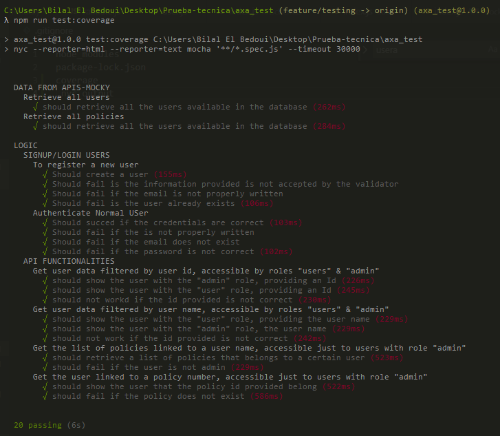
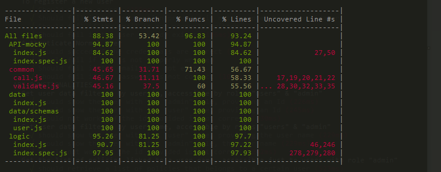

# INSURANCE COMPANY - Designing a clean RESTful API with Node.js (Express + Mongo + testing)


## Introduction

the REST API is using two services that provide data about company clients and policies to manage some information.

To be able to the get following information, you should be authenticated with email/password:

 - Get user data filtered by user id, accessible by roles "users" & "admin"

 - Get user data filtered by user name, accessible by roles "users" & "admin"

 - Get the list of policies linked to a user name, accessible just to users with role "admin"'

 - Get the user linked to a policy number, accessible just to users with role "admin"

## Getting started, Available Scripts:

Follow these steps at the command line:

### 1. Clone and Install 
```bash
git clone https://github.com/bilalelbedoui93/NodeJS-assessment

npm install
```

### 2. Start Mongo
```bash
mongod
```

### 3. Run the solution
```bash
npm run start
```
### 4. To test the API

```bash
npm run test
```

### 5. Run coverage testing

```bash
npm run test:coverage
```

## signup/signin routes

| users                       | Method | Path                 | Returns        |
| --------------------------- | ------ | -------------------- | -------------- |
| Register user               | POST   | /api/rgister         | Object         |
| Authenticate user           | POST   | /api/auth            | Object + token |


## functionalies routes

| functionalies                                  | Method | Token | Path                       | Returns        |
| ---------------------------------------------- | ------ | ----- | -------------------------- | -------------- |
| Get user data filtered by user id              | GET    | ✔     | /api/user/id/:id           | Object         |
| Get user data filtered by user name            | GET    | ✔     | /api/user/name/:name       | Object         |
| Get the list of policies linked to a user name | GET    | ✔     | /api/policies/:name        | Object         |
| Get the user linked to a policy number         | GET    | ✔     | /api/user/policy/:policyId | Object         |


## Testing & Coverage



